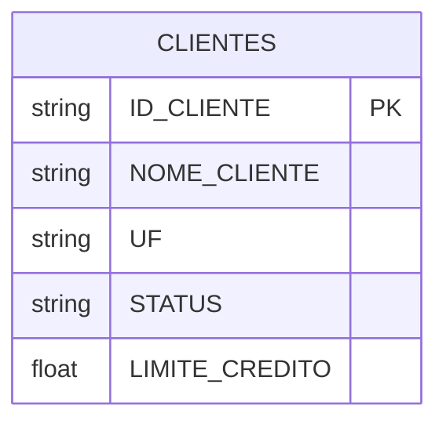

# Operações com Delta Lake

O Delta Lake é uma camada de armazenamento de código aberto que traz transações ACID para processamento em lote e streaming com Apache Spark. Nesta página, demonstraremos as principais operações usando uma tabela de clientes.

## Modelo de Dados

Nossa tabela de clientes possui a seguinte estrutura:

```sql
CREATE TABLE CLIENTES (
    ID_CLIENTE STRING,
    NOME_CLIENTE STRING,
    UF STRING,
    STATUS STRING,
    LIMITE_CREDITO FLOAT
)
```

### Diagrama ER


## Configuração do Spark com Delta Lake

Para começar a usar o Delta Lake, precisamos configurar uma sessão Spark com os pacotes e configurações necessárias:

```python
from pyspark.sql import SparkSession
from pyspark.sql.types import StructType, StructField, StringType, FloatType
from delta import *

# Criar SparkSession com suporte ao Delta Lake
spark = (
    SparkSession
    .builder
    .master("local[*]")
    .config("spark.jars.packages", "io.delta:delta-core_2.12:2.4.0")
    .config("spark.sql.extensions", "io.delta.sql.DeltaSparkSessionExtension")
    .config("spark.sql.catalog.spark_catalog", "org.apache.spark.sql.delta.catalog.DeltaCatalog")
    .getOrCreate()
)
```

## Operações CRUD

### 1. INSERT - Inserindo Dados

Primeiro, definimos o schema e criamos alguns dados de exemplo:

```python
# Definir o schema
schema = StructType([
    StructField("ID_CLIENTE",     StringType(), True),
    StructField("NOME_CLIENTE",   StringType(), True),
    StructField("UF",             StringType(), True),
    StructField("STATUS",         StringType(), True),
    StructField("LIMITE_CREDITO", FloatType(),  True)
])

# Dados iniciais
data = [
    ("ID001", "CLIENTE_X", "SP", "ATIVO",   250000.00),
    ("ID002", "CLIENTE_Y", "SC", "INATIVO", 400000.00),
    ("ID003", "CLIENTE_Z", "DF", "ATIVO",   1000000.00)
]

# Criar DataFrame e salvar como Delta
df = spark.createDataFrame(data=data, schema=schema)
df.write.format("delta").mode("overwrite").save("./dataset/delta")
```

### 2. UPDATE - Atualizando Dados

O Delta Lake suporta operações de MERGE (upsert) para atualizar registros existentes e inserir novos:

```python
# Novos dados para atualização
new_data = [
    ("ID001", "CLIENTE_X", "SP", "INATIVO", 0.00),        # Cliente existente
    ("ID002", "CLIENTE_Y", "SC", "ATIVO",   400000.00),   # Cliente existente
    ("ID004", "CLIENTE_Z", "DF", "ATIVO",   5000000.00)   # Novo cliente
]

df_new = spark.createDataFrame(data=new_data, schema=schema)

# Carregar a tabela Delta
deltaTable = DeltaTable.forPath(spark, "./dataset_delta/CLIENTES")

# Realizar o MERGE (upsert)
(
    deltaTable.alias("dados_atuais")
    .merge(
        df_new.alias("novos_dados"),
        "dados_atuais.ID_CLIENTE = novos_dados.ID_CLIENTE"
    )
    .whenMatchedUpdateAll()    # Atualiza todos os campos se encontrar
    .whenNotMatchedInsertAll() # Insere novo registro se não encontrar
    .execute()
)
```

### 3. DELETE - Removendo Dados

O Delta Lake permite excluir registros com base em condições:

```python
# Deletar clientes com limite de crédito menor que 400.000
deltaTable.delete("LIMITE_CREDITO < 400000.0")
```

## Recursos Avançados

### 1. Time Travel

O Delta Lake mantém o histórico de alterações, permitindo consultar versões anteriores dos dados:

```python
# Consultar versão específica da tabela
df_antiga = spark.read.format("delta") \
    .option("versionAsOf", 0) \
    .load("./dataset_delta/CLIENTES")
```

### 2. Histórico de Transações

Visualize todas as alterações feitas na tabela:

```python
# Exibir histórico de transações
deltaTable.history().show()
```

### 3. Otimização

O Delta Lake oferece comandos para otimizar o armazenamento:

```python
# Compactar arquivos pequenos
deltaTable.optimize().executeCompaction()

# Remover arquivos antigos (retenção padrão de 7 dias)
deltaTable.vacuum()
```

## Boas Práticas

1. **Particionamento**
   - Particione grandes tabelas por colunas frequentemente filtradas
   - Evite muitas partições pequenas
   - Exemplo: particionar por UF em dados regionais

2. **Gerenciamento de Dados**
   - Use `VACUUM` periodicamente para limpar arquivos antigos
   - Configure a retenção de acordo com suas necessidades
   - Mantenha backups antes de operações destrutivas

3. **Otimização de Performance**
   - Use Z-ORDER para otimizar colunas frequentemente consultadas
   - Configure checkpoints adequadamente
   - Monitore o tamanho das transações

4. **Evolução de Schema**
   - Use `.option("mergeSchema", "true")` para evolução segura
   - Documente alterações de schema
   - Teste compatibilidade com versões anteriores

## Referências

- [Documentação Oficial do Delta Lake](https://docs.delta.io/latest/index.html)
- [Delta Lake no GitHub](https://github.com/delta-io/delta)
- [Guia de Melhores Práticas](https://docs.delta.io/latest/best-practices.html) 