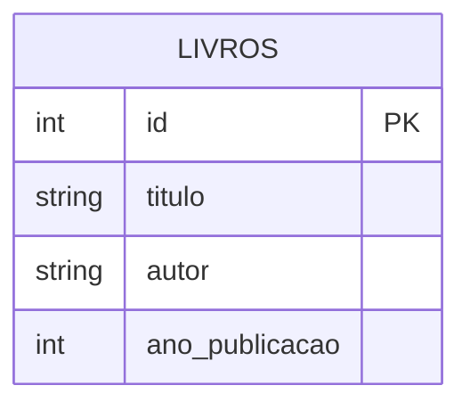

# Operações com Apache Iceberg

O Apache Iceberg é um formato de tabela de alto desempenho para conjuntos de dados muito grandes. Nesta página, demonstraremos as principais operações usando uma tabela de livros.

## Modelo de Dados

Nossa tabela de livros possui a seguinte estrutura:

```sql
CREATE TABLE livros_iceberg (
    id INT,
    titulo STRING,
    autor STRING,
    ano_publicacao INT
)
```

### Diagrama ER


## Configuração do Spark com Apache Iceberg

Para começar a usar o Apache Iceberg, precisamos configurar uma sessão Spark com as dependências e configurações necessárias:

```python
from pyspark.sql import SparkSession

# Criar SparkSession com suporte ao Iceberg
spark = SparkSession.builder \
    .appName("IcebergLocalDevelopment") \
    .config('spark.jars.packages', 'org.apache.iceberg:iceberg-spark-runtime-3.5_2.12:1.6.1') \
    .config("spark.sql.extensions", "org.apache.iceberg.spark.extensions.IcebergSparkSessionExtensions") \
    .config("spark.sql.catalog.local", "org.apache.iceberg.spark.SparkCatalog") \
    .config("spark.sql.catalog.local.type", "hadoop") \
    .config("spark.sql.catalog.local.warehouse", "spark-warehouse/iceberg") \
    .getOrCreate()
```

## Operações CRUD

### 1. CREATE e INSERT - Criando a Tabela e Inserindo Dados

O Apache Iceberg permite criar tabelas e inserir dados usando SQL:

```sql
-- Criar tabela de livros
CREATE TABLE local.livros_iceberg (
    id INT,
    titulo STRING,
    autor STRING,
    ano_publicacao INT
) USING iceberg;

-- Inserir dados iniciais
INSERT INTO local.livros_iceberg VALUES
    (1, '1984', 'George Orwell', 1949),
    (2, 'Dom Casmurro', 'Machado de Assis', 1899),
    (3, 'O Hobbit', 'J.R.R. Tolkien', 1937);
```

Para visualizar os dados:
```python
# Consultar dados
spark.sql("SELECT * FROM local.livros_iceberg").show()
```

### 2. UPDATE - Atualizando Dados

O Iceberg suporta atualizações SQL diretas:

```sql
-- Atualizar o nome do autor
UPDATE local.livros_iceberg
SET autor = 'M. de Assis'
WHERE id = 2;
```

### 3. DELETE - Removendo Dados

Podemos excluir registros usando SQL:

```sql
-- Remover um livro específico
DELETE FROM local.livros_iceberg
WHERE id = 3;
```

## Recursos Avançados

### 1. Time Travel

O Iceberg mantém o histórico de alterações e permite consultas em versões anteriores:

```sql
-- Consultar versão específica
SELECT * FROM local.livros_iceberg VERSION AS OF 1;

-- Consultar por timestamp
SELECT * FROM local.livros_iceberg TIMESTAMP AS OF '2024-03-15 10:00:00';
```

### 2. Evolução de Schema

O Iceberg oferece operações seguras de evolução de schema:

```sql
-- Adicionar nova coluna
ALTER TABLE local.livros_iceberg 
ADD COLUMN preco DECIMAL(10,2);

-- Renomear coluna
ALTER TABLE local.livros_iceberg 
RENAME COLUMN preco TO valor;
```

### 3. Particionamento

O Iceberg suporta particionamento flexível:

```sql
-- Criar tabela particionada por ano
CREATE TABLE local.livros_iceberg (
    id INT,
    titulo STRING,
    autor STRING,
    ano_publicacao INT
) USING iceberg
PARTITIONED BY (ano_publicacao);
```

## Boas Práticas

1. **Gerenciamento de Schema**
   - Use evolução de schema de forma incremental
   - Mantenha compatibilidade com versões anteriores
   - Documente todas as alterações de schema

2. **Particionamento**
   - Escolha colunas de partição com base nos padrões de consulta
   - Evite particionamento excessivo
   - Use particionamento dinâmico quando apropriado

3. **Otimização**
   - Execute compactação regularmente
   - Monitore o tamanho das partições
   - Use estatísticas para otimizar consultas

4. **Manutenção**
   - Faça backup dos metadados
   - Monitore o uso de armazenamento
   - Limpe snapshots antigos periodicamente

## Vantagens do Apache Iceberg

1. **Formato Aberto**
   - Especificação aberta e documentada
   - Suporte a múltiplas engines de processamento
   - Independência de vendor

2. **Performance**
   - Particionamento oculto e eficiente
   - Estatísticas de nível de arquivo
   - Filtros de dados otimizados

3. **Confiabilidade**
   - Transações ACID
   - Evolução de schema segura
   - Controle de concorrência

## Referências

- [Documentação Oficial do Apache Iceberg](https://iceberg.apache.org/)
- [Guia do Apache Iceberg](https://iceberg.apache.org/docs/latest/)
- [Iceberg no GitHub](https://github.com/apache/iceberg) 