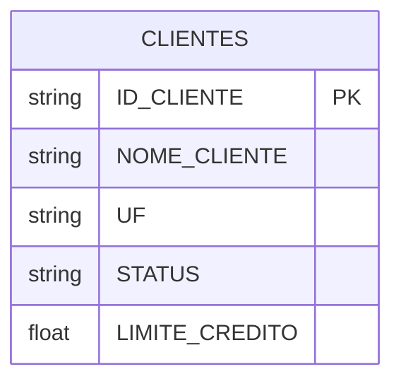
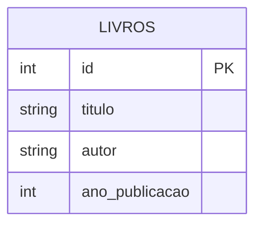

# Data Lake com Apache Spark

Bem-vindo à documentação do nosso projeto de Data Lake usando Apache Spark com os formatos de tabela Delta Lake e Apache Iceberg.

## Visão Geral

Este projeto demonstra a implementação de um Data Lake usando dois formatos populares de tabela:

- [Delta Lake](delta/index.md): Uma camada de armazenamento de código aberto que traz transações ACID para o Apache Spark.
- [Apache Iceberg](iceberg/index.md): Um formato de tabela de alto desempenho para grandes conjuntos de dados.

## Cenários de Exemplo

### 1. Delta Lake - Gestão de Clientes

Demonstração usando uma tabela de clientes com informações como:
- ID do cliente
- Nome do cliente
- UF
- Status (Ativo/Inativo)
- Limite de crédito

### 2. Apache Iceberg - Catálogo de Livros

Demonstração usando uma tabela de livros contendo:
- ID do livro
- Título
- Autor
- Ano de publicação

## Modelos de Dados

### Tabela de Clientes (Delta Lake)


### Tabela de Livros (Iceberg)


## Como Começar

1. Siga as instruções de instalação no [README](../README.md)
2. Explore os exemplos em:
   - [Operações com Delta Lake](delta/operations.md)
   - [Operações com Apache Iceberg](iceberg/operations.md)

## Estrutura do Projeto

```
datalake-with-spark-and-iceberg/
├── notebooks/
│   ├── dataset_delta/        # Dados de exemplo Delta Lake
│   ├── dataset_iceberg/      # Dados de exemplo Iceberg
│   ├── spark_delta.ipynb     # Notebook com operações Delta Lake
│   └── spark-iceberg.ipynb   # Notebook com operações Iceberg
└── docs/
    ├── delta/               # Documentação Delta Lake
    └── iceberg/            # Documentação Apache Iceberg
``` 